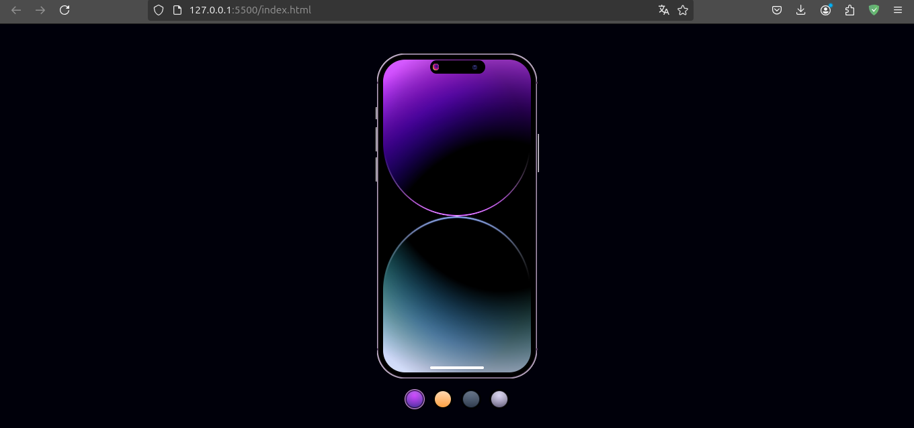

# iOS - Dynamic Music

A web-based reproduction of the iOS Dynamic Island interface, showcasing how to build responsive and interactive UI elements using modern web technologies.

## 🚀 Technologies Used

- **HTML5**: Used for the semantic structure of the page.
- **CSS3**: Leveraged for layout (Flexbox/Grid), transitions, and complex animations to replicate the Apple-style "Dynamic Island" behavior.

## 📂 Project Structure

Below is the directory structure for this project:

```text
.
├── assets/
│   └── css/
│       └── styles.css
├── index.html
└── README.md
```

## 🛠️ How to Execute

To view and interact with the project:

1. **Clone or Download** this repository.
2. Locate the `index.html` file in the project folder.
3. **Open `index.html`** in any modern web browser (Chrome, Firefox, Safari, Edge).

## 📸 Project Showcase



## ⚖️ Disclaimer

This project is for **educational and student purposes only**. It is a non-profit project created solely to study and practice front-end development techniques.
